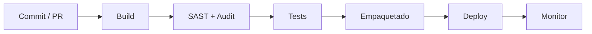

# DevSecOps en Mi App Segura

Documento que integra **preparación de entorno**, **resolución de pruebas** y **pipeline DevSecOps**, mostrando cómo automatizamos la seguridad y calidad.

---

## 1. Instalación y configuración del entorno

Para ejecutar y probar la aplicación es necesario instalar:

- **NodeJS**: Entorno de ejecución JavaScript de código abierto.  
  - Descarga: https://nodejs.org/es  
  - Documentación: https://learn.microsoft.com/es-es/windows/dev-environment/javascript/nodejs-overview

- **NPM**: Gestor de paquetes de Node.js.  
  - Instalación incluida con NodeJS.  
  - Para actualizar a la última versión:  
    ```bash
    npm install -g npm@11.3.0
    ```
  - El flag `-g` instala NPM de forma global en el sistema.

---

## 2. Configuración del entorno de pruebas

Antes de ejecutar pruebas, activamos el entorno de desarrollo para logs y recarga en caliente:

```bash
export NODE_ENV=development
```

Luego instalamos dependencias y compilamos:

```bash
npm ci
npm run build
```

---

## 3. Ejecución inicial de tests y solución de errores

Al ejecutar pruebas con Jest:

```bash
npm test
```

Se detectó un error en `spec/persistence/sqlite.spec.js:18:25`, causado por la ruta fija `/etc/todos/` sin permisos de escritura.  

**Solución**: modificar `sqlite.js` y usar ruta relativa:

```js
const dbpath = process.env.DB_PATH || "./data/todo.db";
```

Tras el cambio, `npm test` pasa sin errores.

---

## 4. Actualización de repositorio remoto

Para apuntar a tu fork y rama principal:

```bash
git remote set-url origin https://github.com/TechViking-afk/mi-app-segura.git
git branch -M main
git push -u origin main
```

---

## 5. Análisis de Medidas de Seguridad en el S-SDLC

| Etapa                        | Responsable                   | Medidas identificadas                                                             |
|------------------------------|-------------------------------|-----------------------------------------------------------------------------------|
| **Requisitos**               | Víctor Herrero Esteban        | Política RBAC; definición de criterios de seguridad en el backlog.                |
| **Diseño**                   | Miguel Ángel Ruiz Miranda     | Modelado de amenazas; validación de entradas; diagramas de flujo de seguridad.     |
| **Implementación**           | David Rojo Villalba           | Uso de librerías seguras; prepared statements en SQLite; manejo seguro de errores. |
| **Pruebas**                  | Víctor Herrero Esteban        | SAST con ESLint; pruebas de endpoints con Supertest; cobertura de código ≥ 80%.    |
| **Despliegue y Mantenimiento** | Miguel Ángel Ruiz Miranda   | Escaneo de vulnerabilidades con npm audit; monitorización continua con alertas.   |

---

## 6. Unificación de Aplicaciones y DevSecOps

| Fase DevSecOps     | Descripción                                                                 |
|--------------------|-----------------------------------------------------------------------------|
| Planificación      | Requisitos de seguridad en backlog; historias de usuario con criterios.     |
| Desarrollo         | Análisis en tiempo real con ESLint; pull requests revisados por pares.      |
| Construcción       | Build automático con `npm ci && npm run build`; SAST + `npm audit`.         |
| Pruebas            | `npm test -- --coverage`; validación de endpoints REST.                     |
| Release            | Empaquetado de la imagen Docker con `docker build`.                         |
| Despliegue         | `docker compose up -d`; Infraestructura como código con políticas seguras.  |
| Operaciones        | Monitorización con Prometheus/Grafana; SIEM para eventos de seguridad.      |

---

## 7. Diagrama de flujo DevSecOps



Con este documento, se muestra la **integración de seguridad** desde la instalación y pruebas locales hasta el pipeline automatizado en CI/CD.
